# Hi, I'm Nabira Khan 👋

  

  <b>AI × Security, in both directions:</b> I use AI to solve security problems, and I work on making AI itself secure.

  <i>Final-year CS @ FAST-NUCES Karachi · leading software engineering in healthcare tech · PNPT · CompTIA Security+</i>

---

## 🔭 What I'm building

- **Luxe** protects a photograph before it is posted, by adding a change too small to see that makes AI image editors fail. It is optimised with projected gradient descent against diffusion inpainting, and judged by the harm it prevents rather than by pixel distance. [Live demo](https://luxe-dlp.vercel.app)
- **ASTWA** (final-year project, with two teammates) tests web applications built with AI tools such as Lovable and Claude Code: it reads the source, boots the app in a sandbox, creates its own test users and probes it as each of them, and reports only what it has proven. My part covers the pipeline, the reasoning inside it and its measurement.

## 💼 Experience

- **Healthcare technology company** (Aug 2026 to present): leading software engineering on products that handle clinical data.
- **Habib Bank** (summer): IT risk, checking a core banking environment against ISO 27001.
- **DevelopersHub** (summer): web application security assessment; found six critical flaws, then fixed them.

## 🔬 Research

- Co-authoring a systematic review of how the literature names social engineering attacks.

## 🏅 Highlights

- **PNPT** (TCM Security) · **CompTIA Security+**
- Dean's List every year · first in my cohort, Fall 2024 · teaching assistant every semester

---

## 🌐 Socials

  
  
  

---

## 💻 Tech Stack

### AI & ML

  
  
  
  

### Languages

  
  
  
  
  
  
  

### Frameworks & Libraries

  
  
  
  
  
  

### Security Tools

  
  
  
  
  
  
  

---

## 🌐 Currently Exploring

- Adversarial machine learning, and making protection transfer to black-box models
- LLM-driven security testing that proves what it reports
- Offensive security across web, network, cloud and APIs

## 🎯 Goal

To be an engineer who can both build AI systems and break them, and in time to lead research at the intersection of AI and security.

---

  <i>"In cybersecurity, the only constant is change. Stay curious, stay vigilant."</i>

